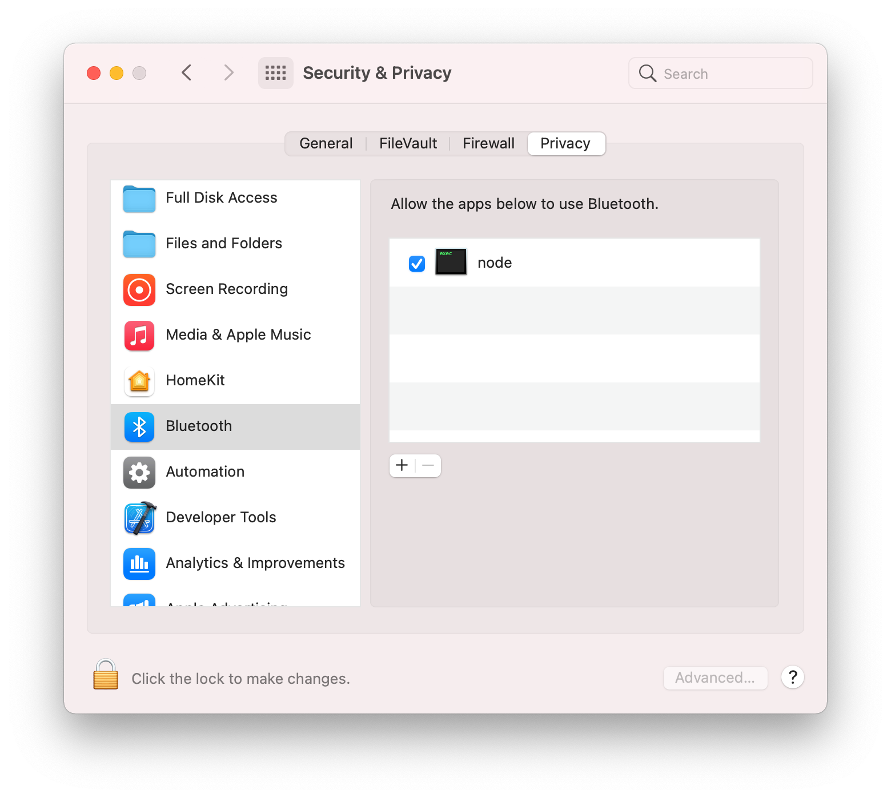

<span align="center">

<a href="https://github.com/homebridge/verified/blob/master/verified-plugins.json"></a>

# @switchbot/homebridge-switchbot

[](https://www.npmjs.com/package/@switchbot/homebridge-switchbot)
[](https://www.npmjs.com/package/@switchbot/homebridge-switchbot)
[](https://discord.gg/5wYTbwP4ha)

<p>The Homebridge <a href="https://www.switch-bot.com">SwitchBot</a> plugin allows you to access your SwitchBot Device(s) from HomeKit with
  <a href="https://homebridge.io">Homebridge</a>.
</p>

</span>

## Installation

1. Search for "SwitchBot" on the plugin screen of [Homebridge Config UI X](https://github.com/oznu/homebridge-config-ui-x)
2. Find: `@switchbot/homebridge-switchbot`
   - See noble [prerequisites](https://github.com/abandonware/noble#prerequisites) for your OS. (This is used for BLE connection.)
3. Click **Install**

## Configuration

- ### If using OpenAPI Connection
  1. Download SwitchBot App on App Store or Google Play Store
  2. Register a SwitchBot account and log in into your account
  3. Generate an Token within the App
     - Click Bottom Profile Tab
     - Click Preference
     - Click App version 10 Times, this will enable Developer Options
     - Click Developer Options
     - Click Copy `token` to Clipboard
  4. Input your `token` into the config parameter
  5. Generate an Secret within the App
     - Click Bottom Profile Tab
     - Click Preference
     - Click App version 10 Times, this will enable Developer Options
     - Click Developer Options
     - Click Copy `secret` to Clipboard
  6. Input your `secret` into the config parameter
- ### If using BLE Connection
  1. Download SwitchBot App on App Store or Google Play Store
  2. Register a SwitchBot account and log in into your account
  3. Click on Device wanting to connect too plugin
     - Click the Settings Gear
     - Click Device Info
     - Copy BLE Mac aka `deviceId`
  4. Input your `deviceId` into the Device Config

## Troubleshooting

- ### If using Linux / Raspberry Pi OS
  1. `bluetoothctl` must be installed on the device, otherwise it cannot communicate via Bluetooth. Enable it with `sudo bluetoothctl power on`.

  2. If errors occur, while enabling it, restart the process:
     - `rfkill block bluetooth`
     - `rfkill unblock bluetooth`

  3. Also make sure, that the computer can discover the SwitchBot device:
     - `sudo bluetoothctl`
     - `scan on`

     This lists all discovered Bluetooth devices. The BLE address of the SwitchBot device should be included in this list, otherwise your computer does not discover it.

- ### If using MacOS
  1. Manually grant Bluetooth access in System Settings UI for `Security & Privacy -> Privacy` to the node executable, eg `/usr/local/bin/node`
     
     (This is what is intended in documentation for the noble bluetooth package [prerequisites](https://github.com/abandonware/noble#prerequisites) by "Add terminal app", however for HomeBridge it is `node` that needs the permission granted, not `terminal`.
     Without this step, then you will receive the following error when the swichbot plugin launches, which will cause Homebridge or the child bridge process to restart:
  ```
  Error: Failed to initialize the Noble object: unauthorized
    at Noble.<anonymous> (file:///usr/local/lib/node_modules/@switchbot/homebridge-switchbot/node_modules/node-switchbot/src/switchbot.ts:244:19)
    at Object.onceWrapper (node:events:629:26)
    at Noble.emit (node:events:514:28)
    at Noble.onStateChange (/usr/local/lib/node_modules/@switchbot/homebridge-switchbot/node_modules/@stoprocent/noble/lib/noble.js:92:8)
    at NobleMac.emit (node:events:514:28)
  ```

## Supported SwitchBot Devices

- [SwitchBot Humidifier](https://www.switch-bot.com/products/switchbot-smart-humidifier)
  - Supports OpenAPI & Bluetooth Low Energy (BLE) Connections
    - Can Push Updates over OpenAPI
    - Can Receive Updates over BLE and OpenAPI
- [SwitchBot Evaporative Humidifier (Auto-refill)](https://www.switch-bot.com/products/switchbot-evaporative-humidifier-auto-refill)
- [SwitchBot Meter](https://www.switch-bot.com/products/switchbot-meter)
- [SwitchBot Meter Plus (US)](https://www.switch-bot.com/products/switchbot-meter-plus)
- [SwitchBot Meter Plus (JP)](https://www.switchbot.jp/products/switchbot-meter-plus)
- [SwitchBot Indoor/Outdoor Thermo-Hygrometer](https://www.switch-bot.com/products/switchbot-indoor-outdoor-thermo-hygrometer)
  - Supports OpenAPI & Bluetooth Low Energy (BLE) Connections
  - If using OpenAPI:
    - [SwitchBot Hub Mini](https://www.switch-bot.com/products/switchbot-hub-mini), [SwitchBot Hub 2](https://us.switch-bot.com/products/switchbot-hub-2), or [SwitchBot Hub 3](https://us.switch-bot.com/products/switchbot-hub-3) Required
    - Enable Cloud Services for Device on SwitchBot App
  - If using Bluetooth Low Energy (BLE) only:
    - Must supply `deviceId` & `deviceName` to Device Config
    - Check `Enable Bluetooth Low Energy (BLE) Connection` on Device Config
- [SwitchBot Motion Sensor](https://www.switch-bot.com/products/motion-sensor)
  - Supports OpenAPI & Bluetooth Low Energy (BLE) Connections
  - If using OpenAPI:
    - [SwitchBot Hub Mini](https://www.switch-bot.com/products/switchbot-hub-mini), [SwitchBot Hub 2](https://us.switch-bot.com/products/switchbot-hub-2), or [SwitchBot Hub 3](https://us.switch-bot.com/products/switchbot-hub-3) Required
    - Enable Cloud Services for Device on SwitchBot App
  - If using Bluetooth Low Energy (BLE) only:
    - Must supply `deviceId` & `deviceName` to Device Config
    - Check `Enable Bluetooth Low Energy (BLE) Connection` on Device Config
- [SwitchBot Contact Sensor](https://www.switch-bot.com/products/contact-sensor)
  - Supports OpenAPI & Bluetooth Low Energy (BLE) Connections
  - If using OpenAPI:
    - [SwitchBot Hub Mini](https://www.switch-bot.com/products/switchbot-hub-mini), [SwitchBot Hub 2](https://us.switch-bot.com/products/switchbot-hub-2), or [SwitchBot Hub 3](https://us.switch-bot.com/products/switchbot-hub-3) Required
    - Enable Cloud Services for Device on SwitchBot App
  - If using Bluetooth Low Energy (BLE) only:
    - Must supply `deviceId` & `deviceName` to Device Config
    - Check `Enable Bluetooth Low Energy (BLE) Connection` on Device Config
- [SwitchBot Curtain](https://www.switch-bot.com/products/switchbot-curtain)
- [SwitchBot Curtain 3](https://www.switch-bot.com/products/switchbot-curtain-3)
  - Supports OpenAPI & Bluetooth Low Energy (BLE) Connections
  - If using OpenAPI:
    - [SwitchBot Hub Mini](https://www.switch-bot.com/products/switchbot-hub-mini), [SwitchBot Hub 2](https://us.switch-bot.com/products/switchbot-hub-2), or [SwitchBot Hub 3](https://us.switch-bot.com/products/switchbot-hub-3) Required
    - Enable Cloud Services for Device on SwitchBot App
  - If using Bluetooth Low Energy (BLE) only:
    - Must supply `deviceId` & `deviceName` to Device Config
    - Check `Enable Bluetooth Low Energy (BLE) Connection` on Device Config
- [SwitchBot Blind Tilt](https://us.switch-bot.com/products/switchbot-blind-tilt)
  - Supports OpenAPI & partial Bluetooth Low Energy (BLE) Connections
  - If using OpenAPI:
    - [SwitchBot Hub Mini](https://www.switch-bot.com/products/switchbot-hub-mini), [SwitchBot Hub 2](https://us.switch-bot.com/products/switchbot-hub-2), or [SwitchBot Hub 3](https://us.switch-bot.com/products/switchbot-hub-3) Required
    - Enable Cloud Services for Device on SwitchBot App
- [SwitchBot Bulb](https://www.switch-bot.com/products/switchbot-color-bulb)
- [SwitchBot Ceiling Light](https://www.switchbot.jp/collections/all/products/switchbot-ceiling-light)
- [SwitchBot Ceiling Light Pro](https://www.switchbot.jp/collections/all/products/switchbot-ceiling-light)
- [SwitchBot Light Strip](https://www.switch-bot.com/products/switchbot-light-strip)
  - Supports OpenAPI & partial Bluetooth Low Energy (BLE) Connections
  - If using OpenAPI:
    - [SwitchBot Hub Mini](https://www.switch-bot.com/products/switchbot-hub-mini), [SwitchBot Hub 2](https://us.switch-bot.com/products/switchbot-hub-2), or [SwitchBot Hub 3](https://us.switch-bot.com/products/switchbot-hub-3) Required
    - Enable Cloud Services for Device on SwitchBot App
- [SwitchBot Lock](https://us.switch-bot.com/products/switchbot-lock)
- [SwitchBot Lock Pro](https://www.switchbot.jp/products/switchbot-lock-pro)
  - Supports OpenAPI & Bluetooth Low Energy (BLE) Connections
  - If using OpenAPI:
    - [SwitchBot Hub Mini](https://www.switch-bot.com/products/switchbot-hub-mini), [SwitchBot Hub 2](https://us.switch-bot.com/products/switchbot-hub-2), or [SwitchBot Hub 3](https://us.switch-bot.com/products/switchbot-hub-3) Required
    - Enable Cloud Services for Device on SwitchBot App
- US: [SwitchBot Mini Robot Vacuum K10+](https://www.switch-bot.com/products/switchbot-mini-robot-vacuum-k10)
- US: [SwitchBot Floor Cleaning Robot S10](https://www.switch-bot.com/products/switchbot-floor-cleaning-robot-s10)
- JP: [SwitchBot Robot Vacuum Cleaner S1](https://www.switchbot.jp/products/switchbot-robot-vacuum-cleaner)
- JP: [SwitchBot Robot Vacuum Cleaner S1 Plus](https://www.switchbot.jp/products/switchbot-robot-vacuum-cleaner)
  - Supports OpenAPI Connection Only
- [SwitchBot Plug](https://www.switch-bot.com/products/switchbot-plug)
- [SwitchBot Plug Mini (US)](https://www.switch-bot.com/products/switchbot-plug-mini)
- [SwitchBot Plug Mini (JP)](https://www.switchbot.jp/products/switchbot-plug-mini)
  - Supports OpenAPI & Bluetooth Low Energy (BLE) Connections
  - If using OpenAPI:
    - [SwitchBot Hub Mini](https://www.switch-bot.com/products/switchbot-hub-mini), [SwitchBot Hub 2](https://us.switch-bot.com/products/switchbot-hub-2), or [SwitchBot Hub 3](https://us.switch-bot.com/products/switchbot-hub-3) Required
    - Enable Cloud Services for Device on SwitchBot App
- [SwitchBot Bot](https://www.switch-bot.com/products/switchbot-bot)
  - Supports OpenAPI & Bluetooth Low Energy (BLE) Connections
  - If using OpenAPI:
    - [SwitchBot Hub Mini](https://www.switch-bot.com/products/switchbot-hub-mini), [SwitchBot Hub 2](https://us.switch-bot.com/products/switchbot-hub-2), or [SwitchBot Hub 3](https://us.switch-bot.com/products/switchbot-hub-3) Required
    - Enable Cloud Services for Device on SwitchBot App
    - You must set your Bot's Device ID for either Press Mode or Switch Mode in Plugin Config (SwitchBot Device Settings > Bot Settings)
      - Press Mode - Turns on then instantly turn it off
      - Switch Mode - Turns on and keep it on until it is turned off
        - This can get out of sync, since API doesn't give me a status
        - To Correct you must go into the SwitchBot App and correct the status of either `On` or `Off`
  - If using Bluetooth Low Energy (BLE) only:
    - Must supply `deviceId` & `deviceName` to Device Config
    - Check `Enable Bluetooth Low Energy (BLE) Connection` on Device Config
- [SwitchBot Hub 2](https://us.switch-bot.com/products/switchbot-hub-2)
  - Supports OpenAPI & Bluetooth Low Energy (BLE) Connections
    - Enables Humidity, Temperature, and Light Sensor
- [SwitchBot Hub 3](https://us.switch-bot.com/products/switchbot-hub-3)
  - Supports OpenAPI & Bluetooth Low Energy (BLE) Connections
    - Enables Humidity, Temperature, and Light Sensor
- [SwitchBot Battery Circulator Fan](https://us.switch-bot.com/products/switchbot-battery-circulator-fan)
  - Supports OpenAPI Connection Only
- [SwitchBot Water Leak Detector](https://us.switch-bot.com/products/switchbot-water-leak-detector)
  - Supports OpenAPI & Bluetooth Low Energy (BLE) Connections


## BLE Encryption Support

### BLE Encryption Key and Key ID

Some SwitchBot devices (notably newer locks, curtains, and select sensors) require a BLE encryption key and keyId for secure Bluetooth communication. This plugin supports configuring these fields for each device.

#### How to Obtain BLE Encryption Key and Key ID

1. **Open the SwitchBot App** and select your device.
2. Go to **Device Settings** (gear icon).
3. Tap **Device Info**.
4. If your device supports BLE encryption, you will see fields for **Encryption Key** and **Key ID**. (If not visible, your device may not require encryption or may need a firmware update.)
5. Copy the **Encryption Key** and **Key ID** values.

#### How to Configure in Homebridge

In the Homebridge UI, when adding or editing a SwitchBot device, enter the **Encryption Key** and **Key ID** in the provided fields. These values will be securely used for BLE communication with your device.

**Example device config excerpt:**

```json
{
  "deviceId": "E7F8A1B2C3D4",
  "deviceName": "SwitchBot Lock",
  "enableBLE": true,
  "encryptionKey": "0123456789abcdef0123456789abcdef",
  "keyId": "01"
}
```

#### Which Devices Require BLE Encryption?

- SwitchBot Lock (and Lock Pro)
- SwitchBot Curtain 3 (and some Curtain 2 with updated firmware)
- Some sensors and new device models (see device info in app)

If you are unsure, check your device's info in the SwitchBot app. If the fields are present, copy them into the plugin config.

**Note:** If you enter an incorrect key or keyId, BLE communication will fail for that device. Double-check values if you encounter connection issues.

---

## Supported IR Devices

### _(All IR Devices require [SwitchBot Hub 2](https://us.switch-bot.com/products/switchbot-hub-2), [SwitchBot Hub 3](https://us.switch-bot.com/products/switchbot-hub-3), or [Hub Mini](https://www.switch-bot.com/products/switchbot-hub-mini))_

- TV
  - Allows for On/Off and Volume Controls
  - Optional Disable Sending Power Command
- Projector (Displayed as TV)
  - Allows for On/Off and Volume Controls
- Set Top Box (Displayed as Set Top Box)
  - Allows for On/Off and Volume Controls
- DVD (Displayed as Set Top Box)
  - Allows for On/Off and Volume Controls
- Streamer (Displayed as Streaming Stick)
  - Allows for On/Off and Volume Controls
- Speaker (Displayed as Speaker)
  - Allows for On/Off and Volume Controls
- Fans
  - Allows for On/Off Controls
  - Optional Rotation Speed
  - Optional Swing Mode
- Lights
  - Allows for On/Off Controls
- Air Purifiers
  - Allows for On/Off Controls
- Air Conditioners
  - Allows for On/Off, Tempeture, and Mode Controls
  - Optional Disable Auto Mode
- Cameras
  - Allows for On/Off Controls
- Vacuum Cleaners
  - Allows for On/Off Controls
- Water Heaters
  - Allows for On/Off Controls
- Others
  - Option to Display as differenet Device Type
    - Supports Fan Device Type
  - Allows for On/Off Controls

## Matter Platform

### Batched refresh and API load control

By default, the Matter platform uses a single batched refresh to update device status. You can tune or override this behavior with the following options under `options`:

- `matterBatchEnabled` (boolean, default true): enable/disable platform-level batched refresh. Devices with a per-device `refreshRate` still run their own timers.
- `matterBatchRefreshRate` (number, seconds): batch interval (falls back to `options.refreshRate`, then 300 if not set).
- `matterBatchConcurrency` (number): limit of parallel OpenAPI status calls during a batch (default 5).
- `matterBatchJitter` (number, seconds): random startup delay before the first batch to reduce synchronized spikes.

Device-level override:

- If a device sets `refreshRate` in its config, it uses a per-device timer and is excluded from the platform batch.

Reliability and rate-limiting:

- Each device status call retries with exponential backoff on non-success responses.
- After exhausting retries, the device enters a short cooldown before being retried; cooldowns are persisted across restarts.
- The batch worklist is randomized every cycle to further distribute API load.

These controls keep API usage smooth and predictable while preserving per-device control when needed.

## What's new in the v4 beta (summary)

- Matter-first: when Homebridge Matter is available the plugin now prefers registering Matter accessories (with HAP fallback).
- Hybrid client: the plugin dynamically imports `node-switchbot@4` if available and falls back to OpenAPI when `openApiToken` is configured.
- UI always served: the plugin UI is packaged into `dist/homebridge-ui` and is always served when Homebridge UI support is present; there is no platform-level opt-out.
- OpenAPI hardening: OpenAPI calls have AbortController timeouts, jittered exponential backoff, per-device retry limits and cooldowns, and safe response parsing for resilient behavior.

- Write coalescing (debounce): command writes to the same device are coalesced by default to avoid command floods. Configure with `writeDebounceMs` (milliseconds, default 100). Set to `0` to disable coalescing.

See `MIGRATION.md` for migration notes and recommended upgrade steps.

## OpenAPI rate limiting and daily budget

To prevent hitting SwitchBot’s daily OpenAPI limit, the plugin provides several platform-level options under `options`:

- `dailyApiLimit` (number, default 10000): maximum OpenAPI requests per day that the plugin will allow.
- `dailyApiReserveForCommands` (number, default 1000): requests reserved for user actions so background polling pauses before the hard limit.
- `webhookOnlyOnReserve` (boolean, default false): when remaining budget reaches the reserve, pause background polling/discovery; webhooks and commands continue until the hard limit.
- `dailyApiResetLocalMidnight` (boolean, default false): if true, resets the daily counter at local midnight; when false, resets at UTC midnight.

Example (excerpt):

```json
{
  "options": {
    "dailyApiLimit": 10000,
    "dailyApiReserveForCommands": 1000,
    "webhookOnlyOnReserve": false,
    "dailyApiResetLocalMidnight": true
  }
}
```

## SwitchBot APIs

- [OpenWonderLabs/node-switchbot](https://github.com/OpenWonderLabs/node-switchbot)
  - [OpenWonderLabs/SwitchBotAPI](https://github.com/OpenWonderLabs/SwitchBotAPI)
  - [OpenWonderLabs/SwitchBotAPI-BLE](https://github.com/OpenWonderLabs/SwitchBotAPI-BLE)

## Community

- [SwitchBot (Official website)](https://www.switch-bot.com/)
- [Facebook @SwitchBotRobot](https://www.facebook.com/SwitchBotRobot/)
- [Twitter @SwitchBot](https://twitter.com/switchbot)
